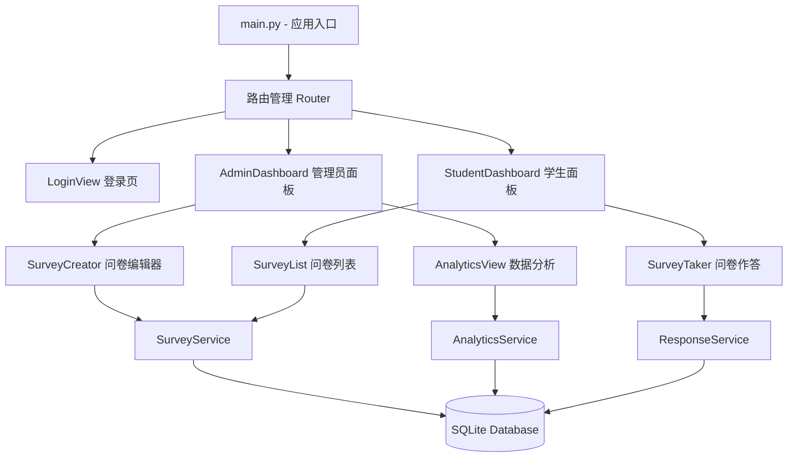

## 产品概述
一个基于 Flet 框架的跨平台医学生伦理调查研究系统，支持 Web 浏览器、iOS 和 Android 三端运行。系统分为管理员端和医学生端两大角色，管理员可创建和管理伦理调查问卷、查看数据分析结果并导出数据；医学生可浏览可用问卷并进行作答。

## 核心功能
- **用户认证与角色管理**：管理员和医学生两种角色，管理员预设账号，医学生可注册登录
- **问卷管理（管理员）**：创建、编辑、发布/下线问卷，支持单选题、Likert 量表题（1-5/1-7级评分）和开放式文本题三种题型
- **伦理主题预设**：内置患者隐私保护、知情同意、临终伦理、科研诚信、医生-患者关系等伦理主题分类
- **问卷作答（医学生）**：浏览已发布问卷列表，进入问卷逐题作答，提交后自动保存回答
- **数据分析（管理员）**：查看各问卷的作答统计，包括各选项分布频次、Likert 量表均值与标准差、开放式回答汇总
- **图表可视化**：以柱状图、饼图展示单选题分布，以雷达图或条形图展示 Likert 量表结果
- **数据导出**：支持将问卷作答数据导出为 CSV 和 Excel 格式文件
- **响应式布局**：自动适配桌面端和移动端屏幕，移动端使用底部导航栏切换页面


## 技术栈选型
- **核心框架**：Flet（Python）- 基于 Flutter 的 Python UI 框架，一套代码同时支持 Web、iOS、Android
- **数据库**：SQLite（通过 Python 内置 sqlite3 模块）- 轻量级无服务器数据库，适合单机/小规模部署
- **图表库**：Matplotlib + Flet 内置 MatplotlibChart 控件 - 直接集成到 Flet 页面中渲染统计图表
- **数据导出**：openpyxl（Excel 导出）+ csv 标准库（CSV 导出）
- **密码安全**：hashlib + secrets 标准库进行密码哈希处理

## 技术架构

### 系统架构
采用分层架构设计：表现层（Flet Views）→ 业务逻辑层（Services）→ 数据访问层（Database），各层职责清晰，便于维护和扩展。



### 数据流设计
1. **问卷创建流**：管理员填写表单 → SurveyService 校验并写入 questions/surveys 表 → 返回问卷列表
2. **问卷作答流**：学生选择问卷 → ResponseService 加载题目 → 逐题渲染 → 提交后批量写入 responses 表
3. **数据分许流**：AnalyticsService 查询 responses 表 → 按题目类型分组统计 → Matplotlib 生成图表 → 渲染到页面
4. **数据导出流**：AnalyticsService 查询完整数据集 → ExportUtil 转换为 CSV/XLSX 格式 → 触发浏览器下载

### 模块划分
- **数据库模块（database/）**：负责数据库连接初始化、表结构定义（surveys、questions、users、responses、response_details）
- **认证模块（auth/）**：用户注册、登录、会话管理，使用 View 切换模拟路由鉴权
- **问卷模块（survey/）**：问卷 CRUD、题目管理、作答收集，核心业务逻辑
- **分析模块（analytics/）**：统计分析、图表生成、数据导出
- **视图模块（views/）**：所有 UI 页面和组件，每个页面一个独立函数或类，通过 page.views 切换

## 实现细节

### 核心目录结构
```
c:/PythonProject/
├── main.py                        # [NEW] 应用入口：初始化数据库、注册路由、启动Flet应用
├── requirements.txt               # [NEW] 项目依赖：flet、openpyxl、matplotlib
├── app/
│   ├── __init__.py
│   ├── config.py                  # [NEW] 配置常量：数据库路径、预设伦理主题列表、Likert量表范围
│   ├── database/
│   │   ├── __init__.py
│   │   ├── db.py                  # [NEW] 数据库连接管理（单例模式）、表初始化DDL
│   │   └── models.py              # [NEW] 数据访问对象：UserDAO、SurveyDAO、QuestionDAO、ResponseDAO
│   ├── auth/
│   │   ├── __init__.py
│   │   └── auth_service.py        # [NEW] 认证服务：注册（密码哈希）、登录验证、当前用户状态管理
│   ├── survey/
│   │   ├── __init__.py
│   │   ├── survey_service.py      # [NEW] 问卷服务：问卷CRUD、发布/下线状态管理
│   │   ├── question_service.py    # [NEW] 题目服务：题目增删改查、排序、题型管理
│   │   └── response_service.py    # [NEW] 作答服务：提交作答、防重复提交、获取作答详情
│   ├── analytics/
│   │   ├── __init__.py
│   │   └── analytics_service.py   # [NEW] 分析服务：频次统计、Likert均值/标准差、图表数据生成
│   ├── views/
│   │   ├── __init__.py
│   │   ├── login_view.py          # [NEW] 登录/注册页：角色选择、表单验证
│   │   ├── admin_dashboard.py     # [NEW] 管理员主页：问卷卡片列表、创建按钮、导航
│   │   ├── survey_creator.py      # [NEW] 问卷编辑器：基本信息+动态添加题目+题目类型选择
│   │   ├── student_dashboard.py   # [NEW] 学生主页：已发布问卷列表、作答状态标记
│   │   ├── survey_taker.py        # [NEW] 问卷作答页：逐题渲染、进度条、提交确认
│   │   ├── analytics_view.py      # [NEW] 数据分析页：图表展示、统计摘要、导出按钮
│   │   └── components/
│   │       ├── __init__.py
│   │       ├── question_card.py   # [NEW] 可复用题目组件：根据题型渲染不同输入控件
│   │       └── chart_widget.py    # [NEW] 图表组件：封装MatplotlibChart，支持柱状图/饼图/雷达图
│   └── utils/
│       ├── __init__.py
│       └── export.py              # [NEW] 导出工具：CSV/Excel 文件生成与保存对话框
```

### 关键设计决策
- **路由方案**：Flet 不内置路由系统，使用 `page.views` 列表 + `page.go()` 方法实现页面切换。在 main.py 中维护一个视图映射字典，每个视图是接受 page 参数并返回 Control 列表的函数。
- **状态管理**：使用 `page.session` 存储当前登录用户信息（user_id、role、username），各页面通过 `page.session.get()` 读取。
- **问卷作答防重复**：在 responses 表对 (survey_id, user_id) 建立唯一约束，每个学生对每份问卷仅能提交一次。
- **移动端适配**：使用 `page.width` 判断设备类型，< 600px 时采用单列移动布局，使用 NavigationBar 底部导航，> 600px 时采用侧边栏 + 内容区双栏布局。
- **图表渲染**：analytics_service 使用 matplotlib 生成图表并保存为 BytesIO 流，chart_widget 将其转换为 Flet 的 Image 控件显示。

### 性能考量
- SQLite 单写入锁限制：作答提交和问卷编辑操作通过事务管理避免冲突
- 图表懒加载：仅在用户切换到分析页面时才生成图表，避免不必要计算
- 问卷列表分页：大量问卷时采用虚拟滚动，每次加载 20 条

### 安全措施
- 密码使用 SHA-256 + 随机盐值哈希存储
- 管理员操作（创建问卷、查看分析）通过 role 字段进行页面级权限校验
- 防 SQL 注入：所有数据库操作使用参数化查询
- CSV/Excel 导出文件在服务端生成后通过 base64 编码传递到前端触发下载


## 设计风格
采用现代医学专业风格，以冷静沉稳的蓝色系为主色调，搭配纯净白色背景和微妙的卡片阴影，营造值得信赖和专业的学术氛围。使用 Flet 内置 Material Design 组件，确保三端视觉一致性。

## 页面规划

### 页面一：登录/注册页
- **顶部区块**：应用 Logo 和标题「医学生伦理调查研究系统」，蓝色渐变背景，白色文字
- **中部表单区块**：卡片容器内包含角色选择（管理员/医学生切换标签）、用户名输入框、密码输入框、登录按钮，医学生角色额外显示注册链接和确认密码字段
- **底部信息区块**：版权信息和版本号，浅灰色小字

### 页面二：管理员仪表盘
- **顶部导航栏**：应用标题、当前用户信息、退出登录图标按钮
- **操作区**：蓝色主按钮「创建新问卷」，带加号图标
- **问卷列表区**：卡片列表展示已有问卷，每张卡片包含问卷标题、伦理主题标签（彩色 Chip）、题目数量、回答人数、发布状态开关、编辑和删除按钮
- **底部导航栏**（移动端）：问卷管理、数据分析两个标签

### 页面三：问卷编辑器
- **顶部区块**：返回箭头 + 标题「创建/编辑问卷」
- **基本信息表单区**：问卷标题输入框、伦理主题下拉选择器、问卷描述多行文本框
- **题目编辑区**：动态可排序题目列表，每道题包含题目文本输入、题型选择下拉框（单选题/Likert量表/开放题）、选项编辑器（单选题动态添加选项，Likert 选择 1-5 或 1-7 级别，开放题仅文本）、删除题目按钮
- **底部操作栏**：添加题目按钮（带虚线边框）、保存问卷蓝色主按钮

### 页面四：学生问卷作答页
- **顶部进度条**：蓝色进度条显示当前作答进度（已答/总题数）
- **题目展示区**：卡片内逐题显示，单选题渲染为 RadioGroup，Likert 量表渲染为带标签的 Slider（如「非常不同意」到「非常同意」），开放题渲染为多行 TextField
- **导航按钮**：上一题/下一题按钮，最后一题显示「提交问卷」红色按钮，提交前弹出确认对话框

### 页面五：数据分析页
- **顶部标签栏**：切换不同问卷的分析视图
- **统计摘要卡片行**：总回答数、完成率百分比、平均作答时间
- **图表展示区**：使用 Tabs 切换不同图表类型，柱状图显示单选题各选项分布，饼图显示比例，Likert 结果用水平条形图展示均值，开放式回答列表展示
- **导出工具栏**：CSV 导出按钮、Excel 导出按钮，带下载图标
