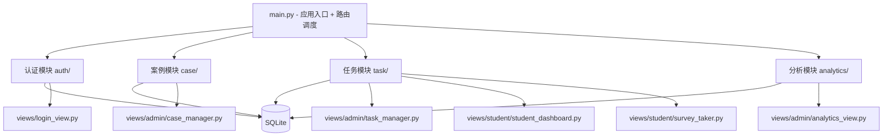

## 产品概述
基于 Flet 框架构建的跨平台医学生伦理调查研究系统，支持 Web 浏览器、iOS 和 Android 三端运行。系统围绕「案例-任务-作答」三层核心数据模型设计：管理员独立维护伦理案例库，创建带时间窗口的调研任务并关联多个案例；医学生在任务有效期内对案例进行作答，系统自动校验时间窗口和防重复提交。

## 核心功能

### 用户权限管理
- **管理员角色**：拥有全部权限——案例 CRUD、任务管理（创建/编辑/发布/关闭）、数据分析和导出
- **医学生角色**：注册登录后，在任务有效期内浏览和作答已分配给自己的案例
- 通过 role 字段进行页面级鉴权，不同角色看到不同的导航和功能入口

### 案例管理（管理员）
- **案例 CRUD**：创建伦理案例，包含标题、案例正文、伦理主题分类（患者隐私、知情同意、临终伦理、科研诚信、医患关系等），每个案例可挂载多种题型的提问
- **题型支持**：单选题、Likert 量表题（1-5 或 1-7 级）、开放式文本题
- **案例复用**：同一案例可被多个任务引用，独立维护，修改案例不影响已完成任务的历史数据

### 任务管理（管理员）
- **任务创建**：设定任务名称、描述、开始时间和结束时间，从案例库中选取一个或多个案例关联到任务
- **时间窗口管控**：学生在 begin_time 至 end_time 区间内才能看到并作答该任务
- **任务状态**：草稿（未发布）、进行中（已发布且在有效期内）、已结束（超过截止时间）
- **案例-任务关联**：支持拖拽排序，决定学生在任务中的作答顺序

### 学生作答
- **任务浏览**：学生首页展示当前有效期内（已发布且未截止）、且未提交过的任务列表
- **逐案作答**：进入任务后按顺序对每个关联案例逐题作答，顶部进度条显示完成进度
- **提交校验**：点击提交时校验任务时间窗口（防止窗口外提交），校验同一任务同一案例是否已提交（防重复），通过后保存所有答案
- **作答回顾**：学生对已提交的任务可查看自己的作答记录（只读模式）

### 数据分析与导出（管理员）
- **任务维度统计**：按任务查看回答提交率、各案例各题的选项分布频次和比例
- **Likert 分析**：量表题计算均值、标准差，以条形图呈现分布趋势
- **图表可视化**：柱状图、饼图展示单选题分布；水平条形图展示量表统计
- **数据导出**：支持按任务导出完整作答数据为 CSV 和 Excel 格式


## 技术栈
- **核心框架**：Flet（Python，基于 Flutter）—— 一套代码同时生成 Web App、iOS 和 Android 应用
- **数据库**：SQLite（Python 内置 sqlite3 模块）—— 轻量级，无需额外服务，数据与系统打包
- **图表**：Matplotlib —— 生成统计图表，通过 Flet 内置 MatplotlibChart 控件渲染
- **数据导出**：openpyxl（Excel）+ csv 标准库（CSV）
- **密码安全**：hashlib（SHA-256）+ secrets（盐值生成）+ pbkdf2_hmac 密钥派生

## 系统架构

### 分层架构


### 数据流设计
1. **案例创建流**：管理员填写案例表单 + 动态添加题目 → CaseService 校验并写入 cases + case_questions 表 → 刷新案例列表
2. **任务发布流**：管理员创建任务 + 选择案例 + 设置起止时间 → TaskService 写入 tasks + task_cases 关联表 → 更新任务状态
3. **学生作答流**：学生进入任务 → TaskService 校验时间窗口 → 加载关联案例和题目 → 逐题渲染作答 → 提交时 ResponseService 二次校验 + 防重复 → 批量写入 responses + response_details
4. **数据分析流**：管理员选择任务 → AnalyticsService 查询 response_details + 关联 questions → 按题型分组统计 → Matplotlib 生成图表 → 渲染展示

### 核心数据模型

```
users: id, username, password_hash, salt, role('admin'|'student'), created_at
cases: id, title, body, theme, created_by, created_at, updated_at
case_questions: id, case_id, question_text, question_type('single_choice'|'likert'|'open'), 
                options(JSON), likert_scale(5|7), sort_order
tasks: id, name, description, start_time, end_time, 
       status('draft'|'published'|'closed'), created_by, created_at
task_cases: id, task_id, case_id, sort_order
responses: id, task_id, case_id, student_id, submitted_at, 
           UNIQUE(task_id, case_id, student_id)
response_details: id, response_id, question_id, answer(TEXT)
```

## 实现要点

### 路由方案
Flet 不内置路由，使用 `page.views` 列表 + `page.go()` 切换页面。在 main.py 定义视图映射字典，每个视图为函数，接收 page 参数返回 Control 列表。

### 状态与鉴权
- 当前用户信息存储在 `page.session`（user_id、role、username）
- 每个视图函数入口检查 session 中是否有用户信息，无则跳转登录页
- 管理员功能入口检查 role == 'admin'，否则拒绝访问

### 时间窗口校验
- **前端层**：学生仪表盘只查询 status='published' 且 start_time <= now <= end_time 的任务
- **后端层**：response_service 提交时再次校验任务时间窗口，防止通过 URL 或其他方式绕过
- **显示层**：任务卡片根据时间状态显示不同标签颜色（进行中-绿色、未开始-蓝色、已结束-灰色）

### 防重复提交
responses 表对 (task_id, case_id, student_id) 建立 UNIQUE 约束，数据库层面兜底；service 层提交前 SELECT 检查，已存在则提示「您已提交过该案例」。

### 移动端适配
- 使用 `page.width` 判断设备类型
- < 600px：单列布局 + NavigationBar 底部导航（标签：首页、我的作答）
- >= 600px：双栏布局（侧边导航 + 内容区）

### 性能与安全
- 所有数据库操作使用参数化查询防 SQL 注入
- 密码使用 PBKDF2-HMAC-SHA256 + 随机 32 位 salt 迭代 10 万次
- 图表按需生成（切换分析页时才调用 matplotlib），避免不必要的计算开销


## 设计风格
医学专业风格，以沉稳蓝色系为主色，白色卡片式布局，营造清晰、可信赖的学术氛围。使用 Flet 内置 Material Design 组件，三端视觉一致性。

## 页面设计

### 页面一：登录/注册页
- 顶部：应用 Logo + 标题「医学生伦理调查研究系统」，蓝色渐变背景，白色文字
- 中部卡片：角色选择 Tabs（管理员/医学生）、用户名输入框、密码输入框；医学生角色自动展示注册字段（确认密码、学号）
- 底部：版本号

### 页面二：管理员仪表盘
- 顶部 AppBar：标题 + 用户信息 + 退出按钮（IconButton）
- 统计卡片行：案例总数、任务总数、进行中任务数、总回答数
- 功能入口卡片网格：案例管理、任务管理、数据分析三大模块入口，每张卡片带图标和描述

### 页面三：案例编辑器
- 返回箭头 + 标题「创建/编辑案例」
- 基本信息区：标题 TextField、主题分类 Dropdown、正文多行 TextField
- 题目编辑区：动态可排序题目列表，每道题含题目文本、题型 Dropdown（单选/Likert/开放题）、选项编辑器（单选题动态添加 Radio 选项、Likert 设置 5/7 级）、删除题目按钮
- 底部固定操作栏：添加题目 OutlinedButton + 保存案例 ElevatedButton

### 页面四：任务编辑器
- 返回箭头 + 标题「创建/编辑任务」
- 基本信息区：任务名称、任务描述、开始时间（DateTimePicker）、结束时间（DateTimePicker）
- 案例选择区：从案例库多选案例，已选案例以 Chip 展示可删除，支持拖拽排序
- 底部：保存草稿 + 发布任务按钮

### 页面五：学生仪表盘
- 顶部 AppBar：标题 + 用户名 + 退出
- 任务列表：卡片列表展示进行中的任务，每张卡片含任务名称、案例数量、截止时间倒计时、作答状态标签（未作答/已提交）、进入作答按钮
- 空状态：无可用任务时显示插图 + 提示文字

### 页面六：问卷作答页
- 顶部进度条：蓝色 LinearProgressIndicator
- 案例标题区：当前案例标题
- 题目展示区：卡片内逐题渲染——单选题 RadioGroup、Likert 带标签 Slider、开放题多行 TextField
- 底部导航：上一题/下一题按钮，最后一题显示「提交」按钮，提交前弹出确认 AlertDialog

### 页面七：数据分析页
- 顶部 Dropdown：选择要分析的任务
- 统计摘要行：完成率、平均提交数、参与人数
- Tab 切换：按案例/按题目查看统计
- 图表区：柱状图、饼图、水平条形图（MatplotlibChart）
- 导出区：CSV 导出、Excel 导出按钮
